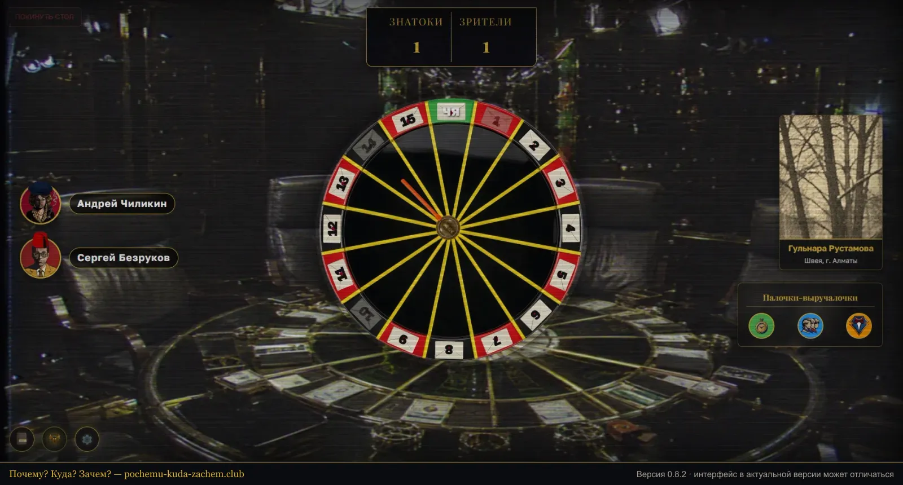

# Почему? Куда? Зачем? (ПКЗ)



**ПКЗ («Почему? Куда? Зачем?»)** — бесплатная браузерная интеллектуальная игра по мотивам телевикторины «Что? Где? Когда?». Ведущий-Крупье и команда из 2–5 знатоков играют против телезрителей до шести очков в атмосфере элитарного интеллектуального клуба 90-х: полумрак, сукно, хрусталь и одна минута на обсуждение.

🎲 **Играть:** [pochemu-kuda-zachem.club](https://www.pochemu-kuda-zachem.club/) · 📜 [Правила](https://www.pochemu-kuda-zachem.club/pravila/) · 🦛 [Что такое ПКЗ](https://www.pochemu-kuda-zachem.club/o-igre/) · 🎧 [Как сыграть с друзьями в Discord](https://www.pochemu-kuda-zachem.club/kak-igrat/)

Текущая версия — **0.8.2**. Независимый фанатский проект, с правообладателями «Что? Где? Когда?» не связан.

## Об игре

- **3–6 игроков:** один Крупье (ведущий и судья) и 2–5 знатоков. Случайного подбора соперников нет — играют компании друзей.
- **Голос — снаружи, стол — здесь.** Игроки общаются в Discord или любом другом голосовом чате, а сайт синхронизирует стол, рулетку, таймер, музыку и звуки у всех участников.
- **Рулетка на 16 секторов:** 15 писем телезрителей с вопросами и зелёный сектор Чёрного ящика.
- **Ровно минута на обсуждение,** сигнал за 10 секунд, гонг. Отвечает тот, кого назначил Капитан.
- **Палочки-выручалочки:** Минута в кредит, Помощь Клуба и Помощь Ведущего — по одной на игру.
- **Штрафы от Крупье** и обязательный **Финальный раунд** при счёте 5:5.
- **Профиль знатока:** статистика, ордена и статуэтки Хрустального и Бриллиантового бегемота, аватары и шапки. Можно войти гостем.
- **Бесплатно,** без доната и рекламы. Работает в браузере на компьютере, планшете и телефоне (альбомная ориентация).

Полный свод правил — в [`pravila/index.html`](pravila/index.html) и на [сайте](https://www.pochemu-kuda-zachem.club/pravila/).

## Стек

| Часть | Технологии | Где работает |
|---|---|---|
| Фронтенд | React 19, React Router 7, Vite 8, Socket.IO client | Vercel |
| Бэкенд | Node.js, Express 5, Socket.IO 4 | Render |
| База данных | Turso (облачный SQLite, `@libsql/client`); локально — файл `server/chgk.db` через `better-sqlite3` | Turso |
| Аналитика | `@vercel/analytics` | Vercel |

Пуш в `master` автоматически деплоит фронтенд на Vercel и бэкенд на Render.

## Структура

```
index.html            — главная SPA + статическое описание для поисковиков (вертикальный экран)
invite.html           — та же SPA с превью-приглашением, отдаётся на /stol/:код
pravila/ o-igre/ kak-igrat/  — статические страницы: правила, «Что такое ПКЗ», инструкция
src/
  components/         — экраны: MainMenu, Lobby, GameLobby, HostView, ExpertView, Profile…
  utils/              — приглашения, аудио, конфиг шапок
server/
  index.js            — Express + Socket.IO: комнаты, рулетка, таймер, счёт, награды
  db.js               — Turso / локальный SQLite
  questions.json      — вопросы телезрителей; bb_questions.json — Чёрный ящик
public/               — ассеты, robots.txt, sitemap.xml, llms.txt, manifest.webmanifest
collectors-vault/     — оригиналы ассетов в полном разрешении (в сборку не попадают)
```

## Локальный запуск

Нужен Node.js 20.19+ или 22.12+ (требование Vite 8).

```bash
npm install
npm run dev
```

`npm run dev` поднимает одновременно Vite (http://localhost:3000) и бэкенд (http://localhost:3001). Без переменных окружения сервер сам переключается на локальную базу `server/chgk.db`.

Другие команды:

```bash
npm run build     # сборка фронтенда в dist/
npm run preview   # просмотр собранной версии
npm start         # только бэкенд (как на Render)
```

### Переменные окружения

| Переменная | Где | Назначение |
|---|---|---|
| `VITE_SERVER_URL` | фронтенд (Vercel) | адрес бэкенда; по умолчанию `http://localhost:3001` |
| `TURSO_DATABASE_URL` | бэкенд (Render) | адрес базы Turso; без неё используется локальный SQLite |
| `TURSO_AUTH_TOKEN` | бэкенд (Render) | токен доступа к Turso |
| `PORT` | бэкенд | порт сервера; по умолчанию `3001` |

## Версии

Номер версии хранится в `package.json` и меняется только при крупных изменениях — новой игровой механике или заметной переработке интерфейса. Правила версионирования и список мест, где обновлять номер, — в [`MASTER_PLAN.md`](MASTER_PLAN.md).

## Документация проекта

- [`MASTER_PLAN.md`](MASTER_PLAN.md) — концепция, правила, архитектура и история разработки
- [`SEO_PLAN.md`](SEO_PLAN.md) — продвижение в поиске и видимость для ИИ-ассистентов

## Автор

Yehor Kudin. Символ клуба — хрустальный бегемот: почему именно он, рассказано на странице [«Что такое ПКЗ»](https://www.pochemu-kuda-zachem.club/o-igre/#begemot).
